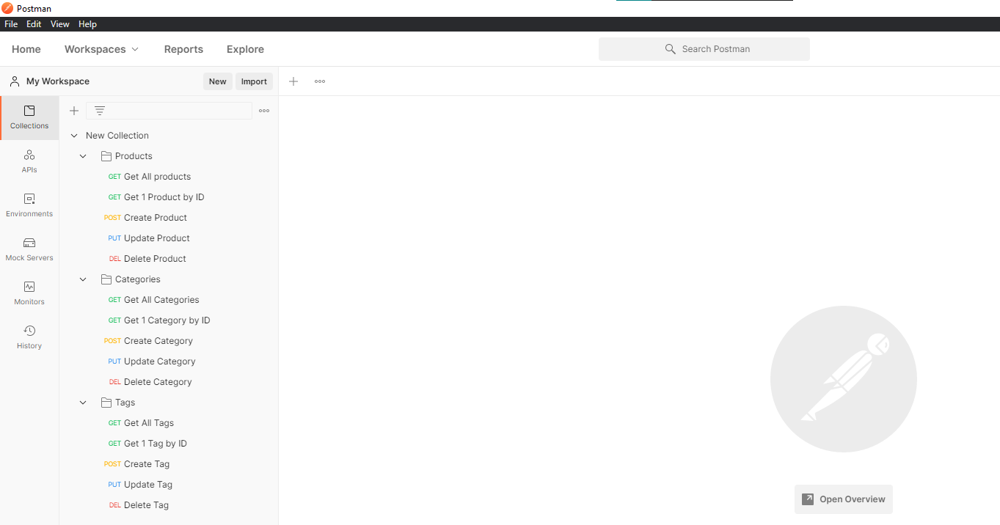

# E-Commerce Back End


## Description
The program is a back end e-commerce product management system. A user is able to Create(POST), Read(GET), Update(PUT), Delete(DELETE) products, categories, and tags. The information is created and updated through SQL tables. 

## Table of Contents
- [Description](#description)
- [Installation](#installation)
- [Usage](#usage)
- [Contributing](#contributing)
- [Questions](#questions)

## Installation
1. Download/clone this repository [E-Commerce Back End](https://github.com/melissa-tan/e-commerce-back-end.git)
	```
	git clone https://github.com/melissa-tan/e-commerce-back-end.git
	```
	
2. Install dependencies
	```
	npm install
	```

3. Run the schema.sql in your database
    ```
    DROP DATABASE IF EXISTS ecommerce_db;
    CREATE DATABASE ecommerce_db;
    ```

4. (Optional) Run seed in your database for starter data
    ```
    nom run seed
    ```

## Usage
1. Run server.js
    ```
    node server.js
    ```

2. This is a full video tutorial on how to use the program! <br>
    Please click on thumbnail to view video. </br>
	[](http://www.youtube.com/watch?v=72Hn-1tsQlw "E-Commerce Back End Full Demo-Click to Watch!")

---

**Products**
- View all products (GET) "/api/products/"
- View one product (GET) "/api/products/productID"
- Add one product (POST) "/api/products/"
```
    {
        "product_name": "PRODUCT NAME",
        "price": 10.00,
        "stock": 100,
        "tagIds": [1]
    }
```
- Update one product (PUT) "/api/products/productID"
```
    {
        "product_name": "PRODUCT NAME",
        "price": 20.00,
        "stock": 0
    }
```
- Delete one product (DEL) "/api/products/productID"

---
**Categories**
- View all categories (GET) "/api/categories/"
- View one category (GET) "/api/categories/id"
- Add one category (POST) "/api/categories/"
```
    {
        "category_name": "CATEGORY NAME"
    }
```
- Update one category (PUT) "/api/categories/id"
```
    {
	    "category_name": "UPDATED CATEGORY NAME"
    }
```
- Delete one category (DEL) "/api/categories/id"

---
**Tags**
- View all tags (GET) "/api/tags/"
- View one tag (GET) "/api/tags/id"
- Add one tag (POST) "/api/tags/"
```
    {
        "tag_name": "TAG NAME"
    }
```
- Update one tag (PUT) "/api/tags/id"
```
    {
	    "tag_name": "UPDATED TAG NAME"
    }
```
- Delete one tag (DEL) "/api/tags/id"


## Contribution
#### Contributors
[Melissa Tan](https://github.com/melissa-tan)


## Questions
If you have any questions or see any issues, please submit an [issue](https://github.com/melissa-tan/e-commerce-back-end/issues) on GitHub!


